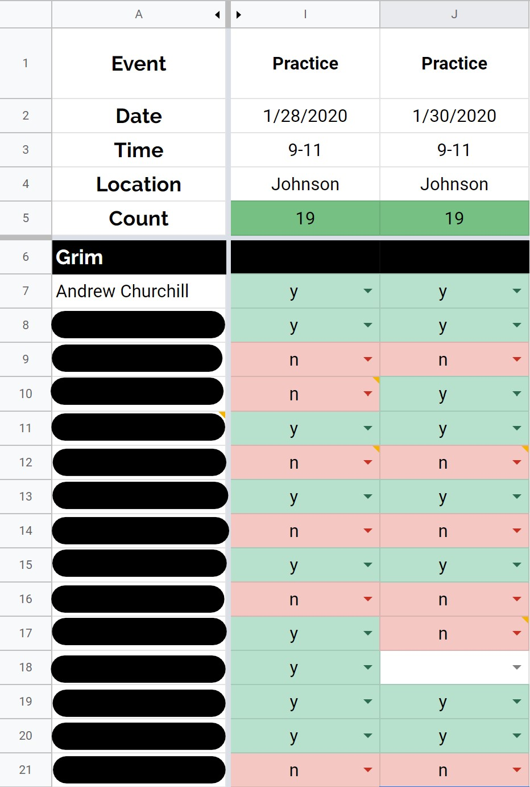
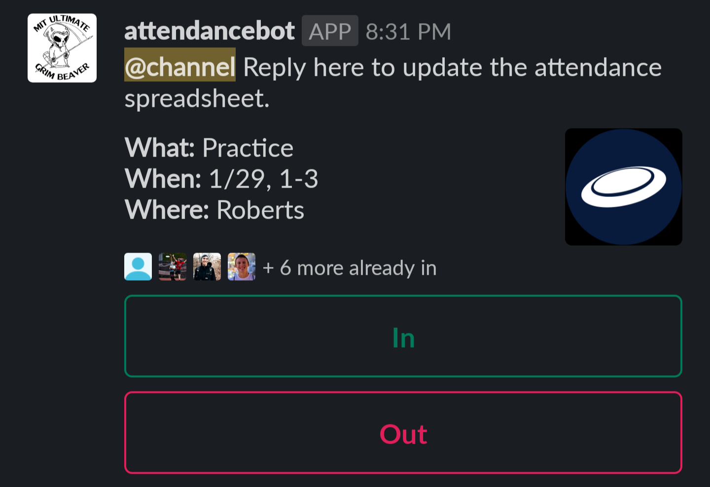
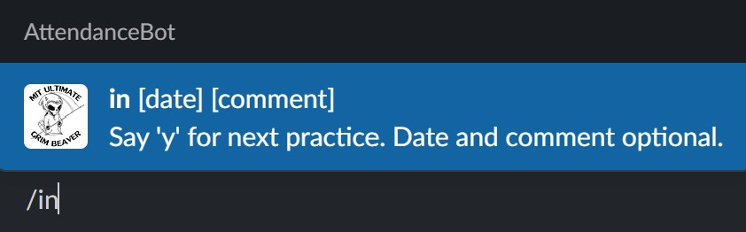
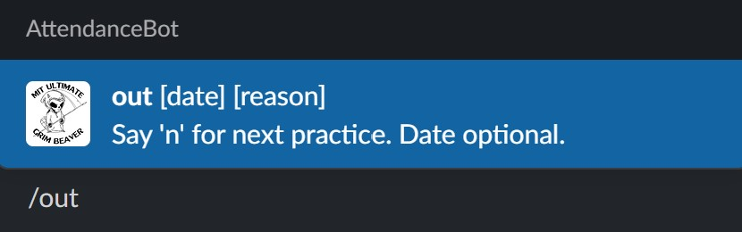
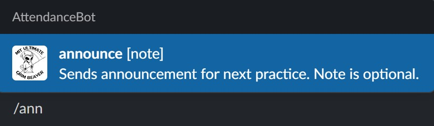
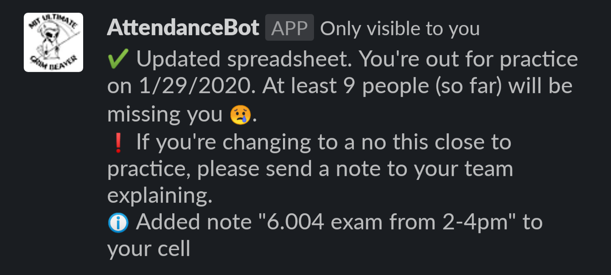
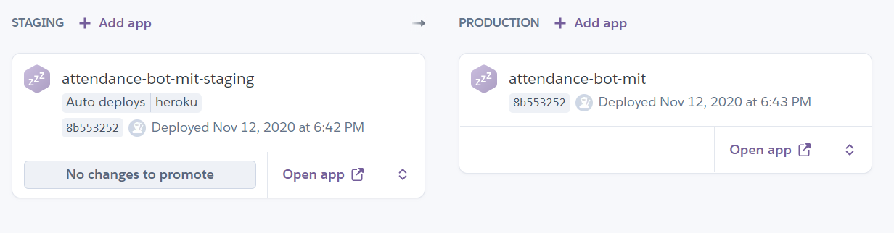

# AttendanceBot

[](https://github.com/google/clasp)


## Descripción General

**AttendanceBot** es una aplicación de Slack para facilitar el seguimiento de quién asistirá a los entrenamientos (o partidos amistosos, o torneos). Nuestro [equipo de Ultimate Frisbee aquí en el MIT](http://mens-ult.mit.edu/) utiliza una hoja de cálculo de asistencia, que se ve así:

.

Utilizar una hoja de cálculo como fuente de verdad tiene muchas ventajas: tiene una interfaz de usuario integrada y bien comprendida, es fácil de usar y robusta, y los jugadores pueden actualizar su asistencia con varias semanas de antelación. Pero actualizar la hoja de cálculo para cada entrenamiento es la norma para la mayoría, y para esos usuarios, una hoja de cálculo es bastante ineficiente. Actualizarla en un teléfono, tras recibir una notificación que les recuerda que el entrenamiento se acerca, requiere abrir una aplicación separada y la interfaz simplemente no es ideal para un dispositivo táctil. Existe una "energía de activación" que mucha gente simplemente no supera (¡te miro a ti, fila 18!). Ahí es donde entra AttendanceBot.

La principal oferta de AttendanceBot es un mensaje de anuncio de entrenamiento útil y atractivo, que se muestra a continuación.



Reduce la tarea de completar la hoja de cálculo a un solo clic de botón (si el jugador puede asistir), o un clic de botón y una breve explicación escrita (si el jugador no puede asistir). También ofrece una visión general de los detalles del entrenamiento y muestra los jugadores que ya se han marcado como asistentes. Agiliza significativamente la tarea de registrar la asistencia.

Pero hay más: AttendanceBot también ofrece algunos comandos de barra (slash commands) sencillos pero potentes, familiares para cualquiera que haya usado Slack durante mucho tiempo. Los comandos de barra, que se muestran a continuación, ofrecen a los jugadores otra forma de actualizar la hoja de asistencia sin salir de Slack.







Y AttendanceBot proporciona una retroalimentación útil al usuario, dándole pistas de uso y asegurándose de que sepa exactamente qué logró su acción.



AttendanceBot está escrito enteramente en TypeScript y está alojado principalmente en Heroku, además de contar con un componente en el servicio de Google Apps Script. La plataforma envía solicitudes POST a la aplicación `express` en el directorio `Heroku`, que gestiona las diferentes entradas posibles. Para obtener información o actualizar la hoja de cálculo, la aplicación de Heroku enviará solicitudes a la parte de Google Apps Script, en el directorio `Google`.


## Configuración Inicial

1. Asegúrate de tener instalado lo siguiente:

   - [`git`](https://git-scm.com/book/en/v2/Getting-Started-Installing-Git)
   - [`node`](https://nodejs.org/en/download/) (esto también instalará `npm`)
   - [`clasp`](https://developers.google.com/apps-script/guides/clasp#installation) (instala la versión 2.3.0 a menos que quieras lidiar con un error de versiones más recientes)
   - [`gh`](https://github.com/cli/cli#installation) GitHub CLI

2. Únete al [espacio de trabajo de prueba de Slack](https://join.slack.com/t/testingworksp/shared_invite/zt-11c5f4rhu-atU6Ym5TIbQUCUrlSH6e8Q) para permitir las pruebas manuales de nuevas funciones fuera de la aplicación principal de Slack.

3. Obtén acceso de escritura a este repositorio contactando al propietario.

## Despliegue

```bash
# guarda el trabajo en un commit y envíalo; esto desplegará a staging automáticamente
git commit -m '[mensaje descriptivo]'
git push origin develop

# después de que terminen los despliegues y realices pruebas manuales en el espacio de trabajo de staging/test
gh workflow run "Deploy Production"
```

Utilizamos GitHub Actions para gestionar el proceso de despliegue a través de Heroku y Google Apps Script.

### Información de Heroku

AttendanceBot tiene un flujo de despliegue sencillo configurado en Heroku:



### Información de Google Apps Script

Utilizamos la CLI `clasp` para enviar/desplegar el proyecto de Google Apps Script. Usamos un truco ([descrito aquí](https://github.com/ericanastas/deploy-google-app-script-action)) para permitir la autenticación con Google Apps Script desde GitHub Actions. Actualmente, la ejecución está vinculada a la cuenta de Google de Andrew (<chu.andrew.8@gmail.com>), por lo que añadir este script a una hoja diferente requeriría compartir esa hoja de cálculo y el script con esa cuenta.

## Contribuciones

¡Las contribuciones y sugerencias son bienvenidas! No dudes en [enviar un problema (issue)](https://github.com/a-churchill/attendance-bot/issues/new) o abrir un pull request.

### Instrucciones de Desarrollo

#### Desarrollo en Heroku

#### Desarrollo en Google Apps Script

1. Crea un Google Apps Script para la hoja de cálculo de asistencia: Herramientas -> Editor de secuencias de comandos.
2. Utilizando la [`clasp` CLI](https://developers.google.com/apps-script/guides/clasp#clone_an_existing_project), clona el proyecto.
3. En el directorio `google/src`, ejecuta `clasp push` para subir el código (añade la bandera `--watch` para que la herramienta `clasp` suba automáticamente cada vez que guardes un archivo).

La clave de API de Slack se almacena en las propiedades de Google Apps Script. También está cifrada en este repositorio con [blackbox](https://github.com/StackExchange/blackbox#blackbox-). Los comandos de barra se especifican en la página de la Aplicación de Slack, bajo "Slash Commands".

## Supuestos sobre Servicios Externos

### Hoja de Cálculo de Asistencia

AttendanceBot extrae todos sus datos de la hoja de cálculo de asistencia que ya utilizamos. Espera que se cumpla lo siguiente:

- Cada columna representa un evento separado, y la información pertinente sobre ese evento (por ejemplo, hora, ubicación) se encuentra en una fila predecible, según se configura en [`constants.ts`](src/constants.ts). _Nota: ninguno de los campos necesita ser único._
- Una columna (que puede estar oculta) contiene el nombre de usuario de Slack de cada jugador en su fila correspondiente.
- La información del evento cambia con poca frecuencia (la información del evento se almacena en caché durante unos 30 minutos después de cualquier fallo de caché). _Nota: los cambios en el número de personas que asisten no se guardan en caché para garantizar la precisión._
  - Los usuarios pueden borrar la caché con un comando **/clear_cache** en Slack.
- La hoja de Administrador de AttendanceBot contiene celdas para facilitar el cambio de administradores y de la hoja actual.

### Heroku

La mayor parte de la lógica está desplegada en Heroku. La aplicación de Slack debe apuntar a la URL correcta del proyecto de Heroku.

La aplicación de Heroku necesita cierta configuración:

- El [Node.js buildpack](https://elements.heroku.com/buildpacks/heroku/heroku-buildpack-nodejs) debe estar instalado.
- Las variables de configuración `API_TOKEN`, `API_TOKEN_TESTING`, `TESTING` y `REDIS_URL` deben estar definidas para la aplicación de Heroku.

### Slack

El bot necesita los siguientes permisos: [channels:history](https://api.slack.com/scopes/channels:history), [channels:read](https://api.slack.com/scopes/channels:read), [chat:write](https://api.slack.com/scopes/chat:write), [commands](https://api.slack.com/scopes/commands), y [users:read](https://api.slack.com/scopes/commands). Además, se asume que la aplicación AttendanceBot está configurada para que los comandos de barra y los comandos interactivos se envíen a las URLs apropiadas. Consulta los archivos de manifiesto en el directorio [`slack`](slack).

### Limitaciones Actuales

- No puede gestionar múltiples eventos en la misma fecha con comandos de barra (siempre devolverá la información del primero). _Nota: técnicamente puede manejarlo (el usuario podría decir "/in #2" para seleccionar el segundo evento del día), pero es demasiado confuso para valer la pena documentarlo, ya que pueden hacer clic en el botón del anuncio para obtener el comportamiento correcto. Es mejor que solo el capitán lidie con la notación de desplazamiento # que todo el equipo._
- La metodología para manejar múltiples eventos el mismo día funciona, pero probablemente podría ser más elegante (actualmente algunas cadenas de fecha tendrán un "#2" o algún desplazamiento añadido al final para especificar el segundo evento de una fecha). El problema principal es que diferentes cadenas de fecha pueden referirse al mismo evento, lo cual es confuso. Si tan solo pudiéramos garantizar un evento por fecha.

## Cambios

| Versión | Cambios                                                          |
| ------- | ---------------------------------------------------------------- |
| 2.0.0   | Migrada la mayor parte de la lógica a Heroku para permitir un aumento masivo del rendimiento |
| 1.1.0   | Mejora del manejo de desplazamientos con el ADT `ColumnLocator`. |
| 1.0.0   | Lanzamiento inicial: /in, /out, /h, /announce y mensaje de anuncio. |
