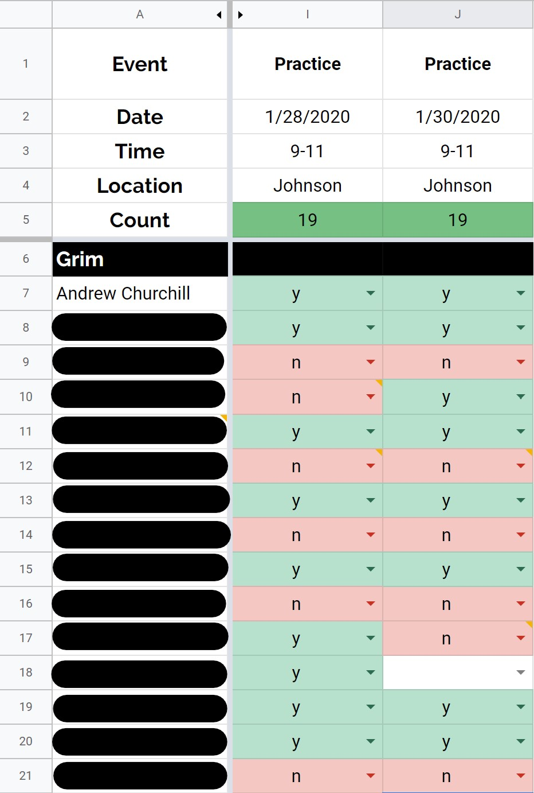
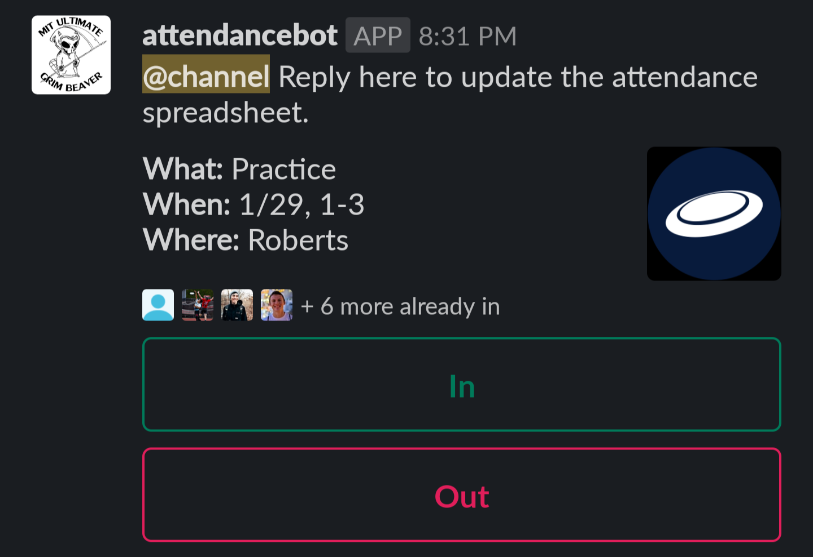
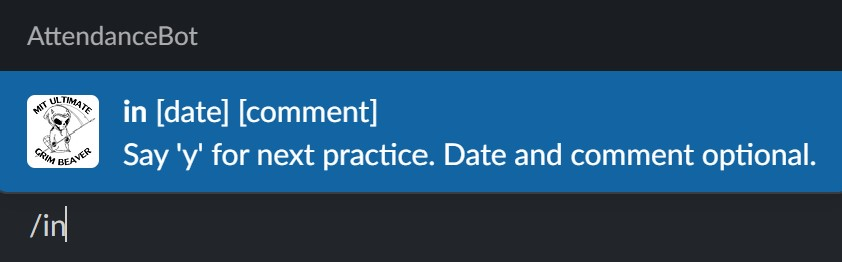
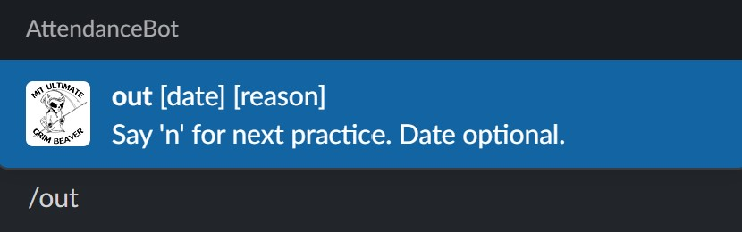
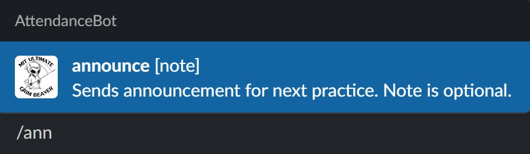
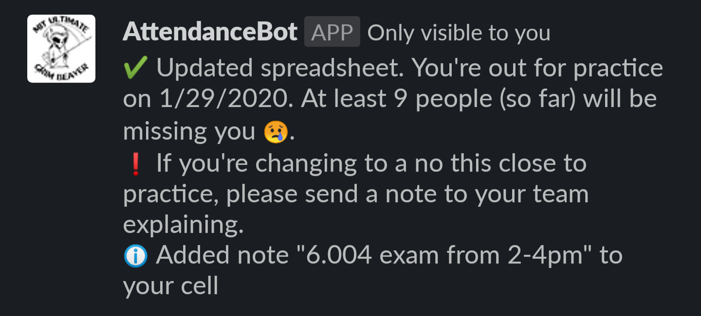
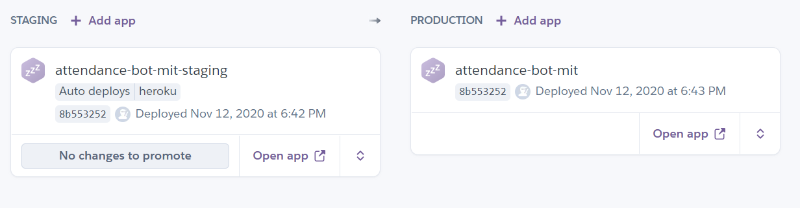

# AttendanceBot

## Overview

**AttendanceBot** is a Slack app to make tracking who's going to practice (or scrimmages, or tournaments) much easier. Our [Ultimate Frisbee team here at MIT](http://mens-ult.mit.edu/) uses an attendance spreadsheet, which looks like this:

.

Using a spreadsheet as the source of truth has a lot of advantages: it has a built-in UI which is well-understood, it is easy to use and robust, and players can update their attendance several weeks in advance. But updating the spreadsheet for every practice is the norm for most, and for those users a spreadsheet is quite inefficient. Updating it on a phone, after receiving a notification reminding them that practice is coming up, requires opening a separate app and the UI is just not great for a touch device. There's an activation energy which many people just don't overcome (looking at you, row 18!). That's where AttendanceBot comes in.

AttendanceBot's main offering is a useful and beautiful practice announcement message, shown below.



It reduces the task of filling out the spreadsheet to a single button click (if the player can come), or a button click and a quick typed explanation (if the player cannot come). It also offers an overview of the practice details, and shows the players who have already marked themselves as coming. It significantly streamlines the task of noting your attendance.

But there's more: AttendanceBot also offers some simple yet powerful slash commands, familiar to anyone who has used Slack for long. The slash commands, shown below, offer players another way to update the attendance spreadsheet without leaving Slack.







And AttendanceBot gives helpful feedback to the user, giving them usage hints and ensuring they know exactly what their action accomplished.



AttendanceBot is written entirely in TypeScript, and it is hosted primarily on Heroku, as well as a component on the Google Apps Script service. The platform sends POST requests to the `express` app in the `Heroku` directory, which handles the different possible inputs. To get information or update the spreadsheet, the Heroku app will send requests to the Google Apps Script portion, in the `Google` directory.


## First-Time Setup

1. Make sure you have the following installed:

   - [`git`](https://git-scm.com/book/en/v2/Getting-Started-Installing-Git)
   - [`node`](https://nodejs.org/en/download/) (this will also install `npm`)
   - [`clasp`](https://developers.google.com/apps-script/guides/clasp#installation)
   - [`gh`](https://github.com/cli/cli#installation) GitHub CLI

2. Join the [testing Slack workspace](https://join.slack.com/t/testingworksp/shared_invite/zt-11c5f4rhu-atU6Ym5TIbQUCUrlSH6e8Q), to allow for manual testing of new features outside of the main Slack app

3. Get write access to this repository by contacting the owner

## Deployment

```bash
# save work in a commit, and push it; this will deploy to staging automatically
git commit -m '[descriptive message]'
git push origin develop

# after deploys finish and you do manual testing on staging/test workspace
gh workflow run deploy-production
```

We use GitHub Actions to manage the deployment process across Heroku and Google Apps Script.

### Heroku Information

AttendanceBot has a simple deploy pipeline set up on Heroku:



The pipeline is set up to automatically deploy anything pushed to the `heroku` branch of this repository. However, the `heroku` branch only contains the code in the `src/Heroku` directory; we can't deploy the entire repository to Heroku, because Heroku can't figure out what it actually needs to deploy. So to push only that code, we use git's `subtree` feature. See the aliases [above](#first-time-setup) for the `git heroku` alias which makes this easy. Then once CI passes, it will be deployed in staging!

Once deployed in staging (and tested manually, if necessary)

### Google Apps Script Information

We use the `clasp` CLI to push/deploy the Google Apps Script project. We use a hack ([described here](https://github.com/ericanastas/deploy-google-app-script-action)) to allow authenticating with Google Apps Script from GitHub Actions. Currently the execution is tied to Andrew's Google account (chu.andrew.8@gmail.com), so adding this script to a different sheet would require sharing that spreadsheet and script with that account.

## Contributing

Contributions and suggestions are welcome! Feel free to [submit an issue](https://github.com/xxaxdxcxx/attendance-bot/issues/new) or open a pull request.

### Development Instructions

#### Heroku Development

#### Google Apps Script Development

1. Create a Google Apps Script for the attendance spreadsheet: Tools -> Script editor.
2. Using the [`clasp` CLI](https://developers.google.com/apps-script/guides/clasp#clone_an_existing_project), clone the project.
3. In the `src/Google/src` directory, run `clasp push` to push the code (add the `--watch` flag to have the `clasp` tool automatically push every time you save a file).

The Slack API key is stored in the Google Apps Script properties. It is also encrypted in this repository with [blackbox](https://github.com/StackExchange/blackbox#blackbox-). The slash commands are specified on the Slack App page, under "Slash Commands".

## Assumptions about External Services

### Attendance Spreadsheet

AttendanceBot pulls all of its data from the attendance spreadsheet we already use. It expects the following to be true:

- Each column represents a separate event, and the pertinent information about that event (e.g. time, location) is in a predictable row, as configured in [`constants.ts`](src/constants.ts). _Note: none of the fields need to be unique._
- One column (which can be hidden) holds each player's Slack username in their corresponding row.
- The event information changes fairly infrequently (event information is cached for about 30 minutes after any cache miss). _Note: changes to the number of people coming are not cached, to ensure accuracy._

### Heroku

The bulk of the logic is deployed to Heroku. The Slack app needs to be pointed at the correct URL of the Heroku project.

The Heroku app needs some configuration:

- The [Node.js buildpack](https://elements.heroku.com/buildpacks/heroku/heroku-buildpack-nodejs) needs to be installed
- The `API_TOKEN`, `API_TOKEN_TESTING`, `TESTING`, and `REDIS_URL` configuration variables need to be defined for the Heroku app

### Slack

The bot needs the following permissions: [channels:history](https://api.slack.com/scopes/channels:history), [channels:read](https://api.slack.com/scopes/channels:read), [chat:write](https://api.slack.com/scopes/chat:write), [commands](https://api.slack.com/scopes/commands), and [users:read](https://api.slack.com/scopes/commands). Also, this assumes that the AttendanceBot application is set up so slash commands and interactive commands are sent to the appropriate URLs.

### Current Limitations

- Cannot handle multiple events on same date with slash commands (will always return info about the first one). _Note: technically it can handle this (the user could just say "/in #2" to select the second event on a day) but this is too confusing to be worth documenting, since they can just click the button on the announcement to get the correct behavior. Better just the captain deals with the # offset notation than the whole team._
- The methodology for handling multiple events on the same day works but could probably be more elegant (currently some date strings will have "#2" or some offset appended to the end to specify the second event on a date.) The main problem is that different date strings can refer to the same event, which is confusing. If only we could just guarantee one event per date.

## Changes

| Version | Changes                                                          |
| ------- | ---------------------------------------------------------------- |
| 2.0.0   | Migrated most logic to Heroku to allow massive performance boost |
| 1.1.0   | Improve handling of offsets with `ColumnLocator` ADT.            |
| 1.0.0   | Initial release: /in, /out, /h, /announce, and announce message. |
